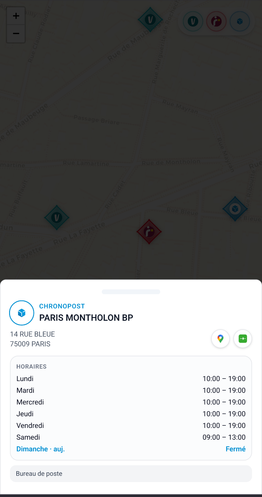

# Parcel — Pickup Point Explorer

A personal map of every parcel pickup point around the addresses I actually use,
across the three carriers that matter in France: **Chronopost**, **Mondial
Relay**, and **Vinted Go**. One map, one set of opening hours, one click to open
Google Maps directions.

The public site at [parcel-thomasbs.lovable.app](https://parcel-thomasbs.lovable.app)
is read-only; an admin area behind a password lets me refresh data, inspect query
history, and run on-demand enrichment jobs.

---

## What it does

### A unified map of every nearby pickup point

Each carrier has its own glyph and color (Vinted Go = teal "V", Mondial Relay =
red, Chronopost = blue cube). Clusters collapse at low zoom levels; filters in
the top-right toggle carriers in and out.


Zoom in and the individual points spread out:


### Detailed point sheet with opening hours

Tap any point and a sheet slides up with the address, today's opening hours,
the rest of the week, the venue type, and shortcut buttons to open Google
Maps or copy directions.



### Admin dashboard

Per-provider summary cards (count, last refresh time, refresh button), an
orphan cleanup utility, and the full history of every query/refresh run with
expandable per-point detail.


### Refresh pipelines, one per carrier

**Chronopost** is fully automated server-side: a single click loops over each
home address and scrapes the nearby relays.


**Mondial Relay** is a hybrid: their endpoint is CORS-locked, so the admin page
copies a scraping script to the clipboard, opens the Mondial Relay site, and
expects a JSON paste-back.


**Vinted Go** runs end-to-end on the server. A list refresh tiles the area
around each home address; a background cron job then enriches each point with
its opening hours, 5 points every 2 minutes, with a live progress bar.


---

## How it's built

- **Frontend**: [TanStack Start](https://tanstack.com/start) (React 19, Vite 7),
  file-based routing, Tailwind v4 with semantic design tokens, shadcn/ui
  components. The map is [MapLibre GL](https://maplibre.org/) with
  [Supercluster](https://github.com/mapbox/supercluster) for clustering.
- **Backend**: [Lovable Cloud](https://lovable.dev) (managed Postgres + auth +
  storage). All server-side logic lives in TanStack Start
  `createServerFn` handlers; public API routes (cron webhook) live under
  `/api/public/`.
- **Hosting**: Cloudflare Workers via the TanStack Start adapter — the entire
  app, including server functions and SSR, runs at the edge.
- **Scraping**:
  - Chronopost: server-side fetches against their public store-locator JSON
    endpoint.
  - Mondial Relay: hybrid client-side script (DevTools paste) because their
    endpoint blocks server-to-server requests.
  - Vinted Go: server-side scrape of the Next.js RSC payload + a per-point
    Server Action to fetch business hours.
- **Background jobs**: `pg_cron` calls a public HTTP endpoint
  (`/api/public/hooks/enrich-vinted-go`) every 2 minutes with a bearer secret;
  the handler validates the secret with `crypto.timingSafeEqual`, parses the
  body with Zod, and processes a small batch.
- **Auth**: simple password-protected admin area with rate-limited login,
  constant-time password comparison, and a signed session cookie. Every admin
  server function is guarded by a `requireAdmin` middleware so endpoints can't
  be called directly.
- **Database design**: `providers`, `pickup_points`, `queries` (one row per
  refresh run), `enrichment_jobs`, `enrichments`, `home_addresses`. All tables
  use Row-Level Security; refresh URLs and scraping scripts live in a separate
  admin-only table.

---

## Local development

```bash
bun install
bun dev
```

The Lovable Cloud backend is provisioned automatically; secrets are managed
through the Lovable dashboard.

---

## Roadmap ideas

- Push notifications when a new relay opens within walking distance of a home
  address
- "Best relay for this parcel" recommendation that scores distance, opening
  hours today, and carrier preferences
- Public sharing of a single point via a short URL
